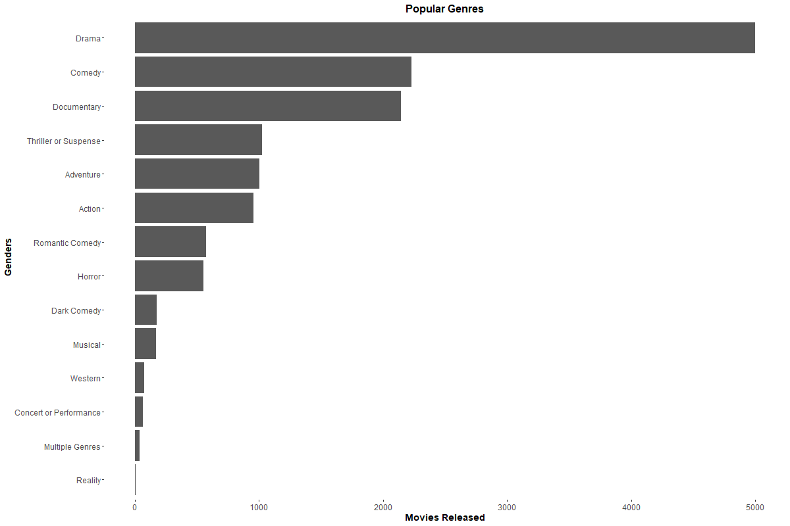
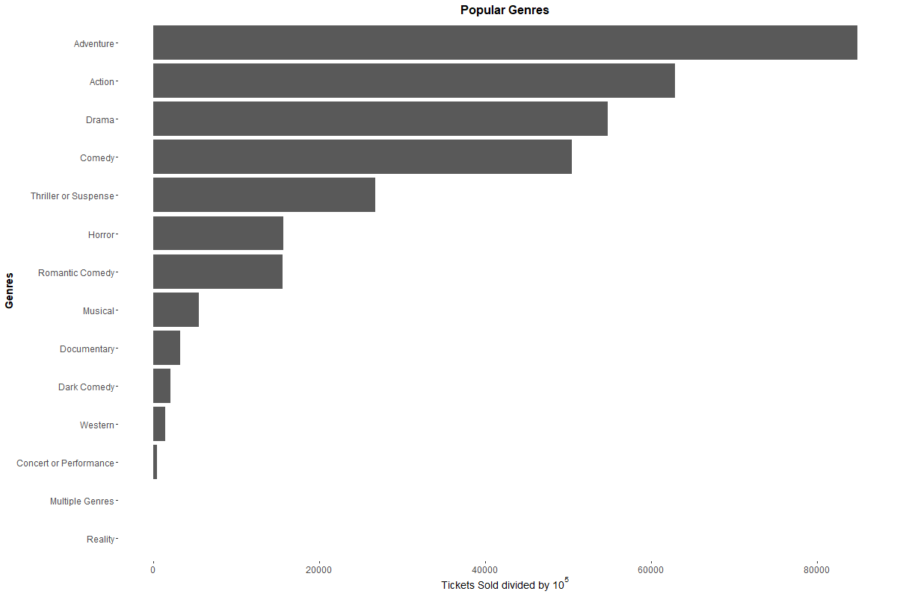
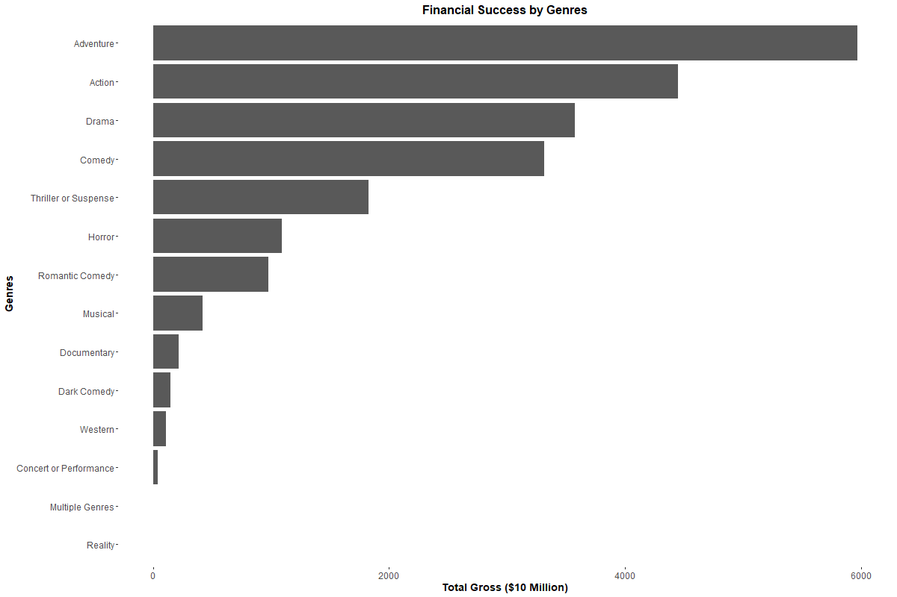
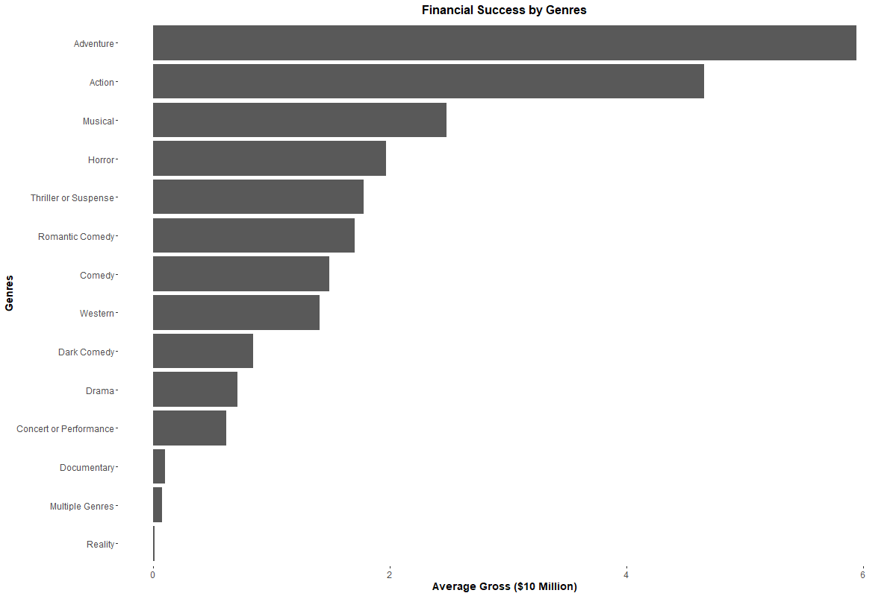
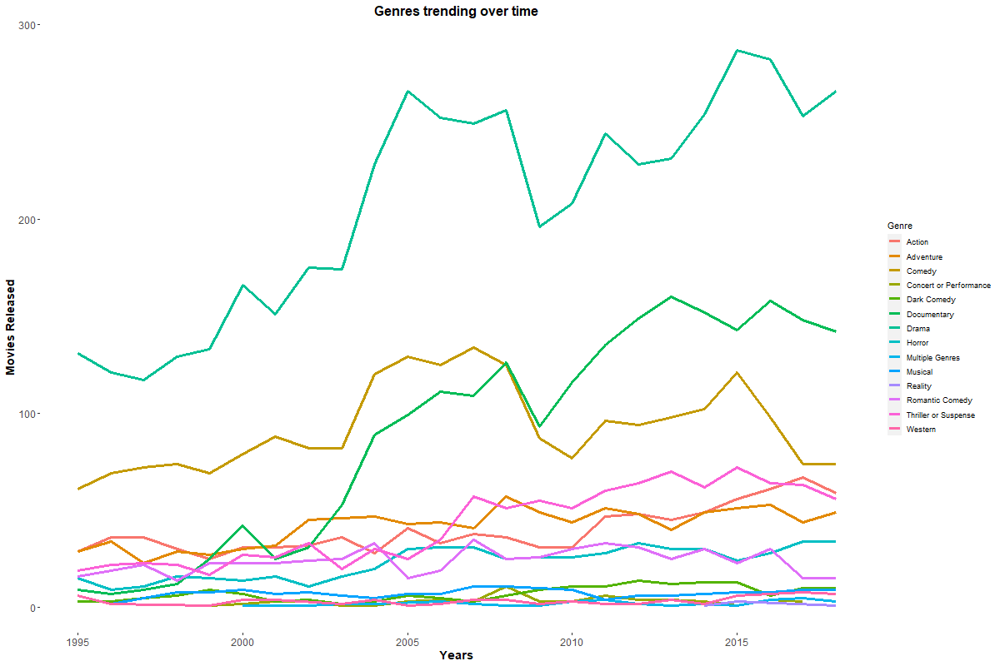

# Movie Genres Statistics

This is my first project using R language, so I tried to explore the dataset and extract some information about it. It shows:

- Genres Popularity by movies released and tickets sold
- Financial Success by adding the gross of each genre over the years and using an average of the total gross divided by the sum of movies released in each genre
- Trend over time looking at movies released every year (1995 - 2018) for each genre and also looking at gross per year
- Top 10 Highest-Grossing movies in this specific period, using the inflation correction for top movies provided.  

# Data

The dataset [Film Genre Statistics](https://www.kaggle.com/datasets/thedevastator/film-genre-statistics?resource=download.) were downloaded from Kaggle and has movie genre statistics and revenue data from 1995-2018. In this project, it can be found inside the folder called "Data" named as "ThrowbackDataThursday Week 11 - Film Genre Stats.csv". Let's see some things about it.

### Size of our data
Number of rows or observations =  300 

Number of columns or variables =  10 

# Popular Genres

Selecting unique values in Genre column and adding all movies released and tickets sold for it (movies_pop). The data still remains as a dataframe. The "movies_pop_mr" and "movies_pop_ts" are the same dataframe as "movies_pop", but ordered by movies released and tickets sold, respectively. Both ordered in decreasing order.

Table: Dataframe with popularity for each genre by movies released and tickets sold

|Genre                  | Movies_Released| Tickets_Sold|
|:----------------------|---------------:|------------:|
|Action                 |             956|   6286733017|
|Adventure              |            1005|   8480812819|
|Comedy                 |            2230|   5040638417|
|Concert or Performance |              63|     49778298|
|Dark Comedy            |             174|    208096184|
|Documentary            |            2143|    322824020|
|Drama                  |            4997|   5474189407|
|Horror                 |             553|   1572563195|
|Multiple Genres        |              39|      3676146|
|Musical                |             170|    547432661|
|Reality                |               5|        74035|
|Romantic Comedy        |             574|   1557896913|
|Thriller or Suspense   |            1024|   2671463214|
|Western                |              77|    146128846|

Below we can see graphics generated from the data above: 

### By Movies Released

Table: Dataframe movies_pop ordered in a decreasing way by movies released

|   |Genre                  | Movies_Released| Tickets_Sold| Porc_total|
|:--|:----------------------|---------------:|------------:|----------:|
|7  |Drama                  |            4997|   5474189407|      35.67|
|3  |Comedy                 |            2230|   5040638417|      15.92|
|6  |Documentary            |            2143|    322824020|      15.30|
|13 |Thriller or Suspense   |            1024|   2671463214|       7.31|
|2  |Adventure              |            1005|   8480812819|       7.17|
|1  |Action                 |             956|   6286733017|       6.82|
|12 |Romantic Comedy        |             574|   1557896913|       4.10|
|8  |Horror                 |             553|   1572563195|       3.95|
|5  |Dark Comedy            |             174|    208096184|       1.24|
|10 |Musical                |             170|    547432661|       1.21|
|14 |Western                |              77|    146128846|       0.55|
|4  |Concert or Performance |              63|     49778298|       0.45|
|9  |Multiple Genres        |              39|      3676146|       0.28|
|11 |Reality                |               5|        74035|       0.04|

<!-- -->

Looking at movies released, for this dataset, Drama is the most popular genre, with almost 5000 movies between 1995 and 2018. It's followed by Comedy and Documentary. These threes, together, answer for almost 67% of all movies released. As we'll see, this actually doesn't mean that they are popular genres, but that they have a largest film catalog. I know that we can think about the offer and demand, so let's take a look at tickets sold. 

### By Tickets Sold

Table: Dataframe movies_pop oredered in a decreasing way by tickets sold

|   |Genre                  | Movies_Released| Tickets_Sold| Porc_total|
|:--|:----------------------|---------------:|------------:|----------:|
|2  |Adventure              |            1005|   8480812819|      26.21|
|1  |Action                 |             956|   6286733017|      19.43|
|7  |Drama                  |            4997|   5474189407|      16.92|
|3  |Comedy                 |            2230|   5040638417|      15.58|
|13 |Thriller or Suspense   |            1024|   2671463214|       8.25|
|8  |Horror                 |             553|   1572563195|       4.86|
|12 |Romantic Comedy        |             574|   1557896913|       4.81|
|10 |Musical                |             170|    547432661|       1.69|
|6  |Documentary            |            2143|    322824020|       1.00|
|5  |Dark Comedy            |             174|    208096184|       0.64|
|14 |Western                |              77|    146128846|       0.45|
|4  |Concert or Performance |              63|     49778298|       0.15|
|9  |Multiple Genres        |              39|      3676146|       0.01|
|11 |Reality                |               5|        74035|       0.00|

<!-- -->

Here we can see that adding tickets from Adventure and Action movies, they sold more tickets than all of our previous top 3 most popular genres added together. Actually, Adventure almost made it alone. I think this is a better way to understand the popularity of a genre movie, because it's actually the public response. We need to consider that these are movies for almost everyone and easy to watch, despite film's budget. Related to the idea of measure the popularity of a genre or movie by how many tickets they sold, we will look now for financial success.

Obs.: Because of the scale of the graphic, we can't see clearly how many tickets were sold or how many movies were released. This information can be seen in the respectively dataframe.

# Measuring Financial Success

The revenue of a movie determines if it will be a success or a failure, so now we will look which are the most successful genres and establish a metric to be the first revenue projection if you want to produce a movie. At first, let's take a look at the total gross of each genre. We expect to see something similar to the rank for popularity by tickets sold. The data, in this case, is available at a dataframe called "movies_fs".

Besides "Total_Gross_genre", we see a variable called "Top_Movie_Gross", which give us the possibility to identify if there is some movie that behaves like an outlier and if it's pulling up our metric, that we will call "Average Gross". 

### Gross by Genre

<!-- -->

We can see that Adventure, Action and Drama are the most successful genres, like we expected. Summing these with Comedy, we have 78.2% of all gross of all genres from 1995 to 2018, turning them into the most profitable genres.

Now let's take a look at Gross Average.

### Gross Average

The first thing to note is that Drama and Comedy leave the top positions for and Musical and Horror. Another thing is that Action and Adventure, especially Adventure, are still leading the rank with a lot of "advantage".

It's important to remember that in the same period, when Adventure and Action released a little bit more than 1000 movies, Drama and Comedy released around 5000 and 2500, respectively, which has a serious impact in our metrics.

<!-- -->

So, the most profitable genres are Adventure and Action, with mention to Musical and Horror, that won't released so many movies, but have a good revenue. Futhermore, movies made by famous film studios, called blockbusters, even when they failure, they pull up the revenue of their genre. 

# Genre Movies Released Over Time

In this section we can see that, even not being the most profitable genre, drama released more movies, with a peak nearly 2014 followed by a drop and now it's growing again.

Documentary has an interesting behavior after early 2000s, when it grows and reach the second position in the rank that was occupied by Comedy, which fell to third.

<!-- -->

Adventure, Action and Thriller or Suspense slightly detach from the last genres, but like them, they remain constant in recent years, with some oscillations.

# Genre Movies Gross Over Time

Again, Adventure and Action are the champions. Adventure remains constant since early 2000s, with a peak in 2015 and Action goes up since nearly 2005 until reaches the top nearly 2016.

Drama is a stable genre in general and Comedy is in decline, after its peak nearly 2007. Thriller or Suspense was interesting around 2007 and 2014, but now its returning to the revenue from 1995.

Musical genre after 2015 had an increasing revenue for a short time, may one or two hit movies are the cause (Beauty and the Beast - 2017).

<!-- -->

# Top 10 Highest-Grossing Movies

Here, I used the column called "Top.Movie.Inflation.Adjusted.Gross..That.Year." to be fair with older movies, such as Titanic, which is the highest-grossing movie in this data.

I put different colors to identify genres and, as expected, Adventure and Action dominate the highest-grossing movies.

<!-- -->

Splitting the period in three (1995-2002, 2003-2010, 2011-2018) we observe that in the highest-grossing movies, 90% of the films were released in the first or the third period. The gap that we observe could be or not related to some other aspect like economic crisis, beyond good or bad movies.

Avatar was released in 2009 and was the first movie to reach 1 billion in revenue, but in this data this isn't shown, which lead us to think that is probably USA data about movies instead of worldwide.

From 2018 until today we have a lot of movies been released and the expansion of streaming platforms, which interfere in this industry.
